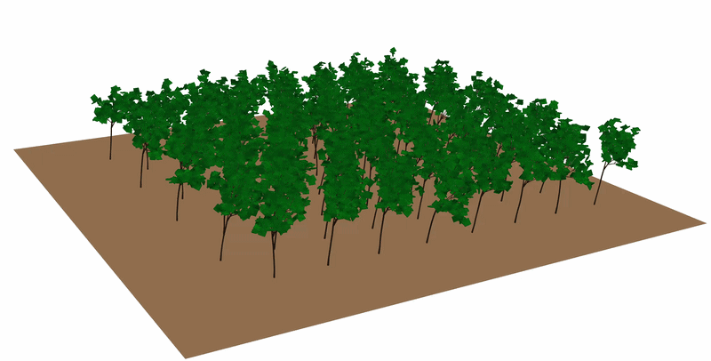
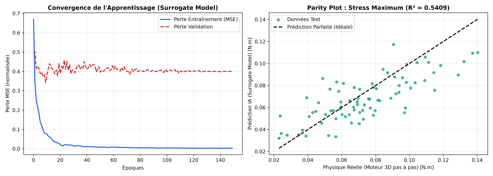

# L-systems-Plants

### A 3D aeroelastic simulation of forest ecosystems under storm winds, powered by Physics-Informed Deep Learning.

---

<div align="center">
  
  <p><em>Real-time 3D rendering of dynamic forest canopies under oscillating wind waves (PyVista / VTK).</em></p>
</div>

---

## Motivations

This project was born out of personal curiosity and a desire to connect mathematics, nature, and interactive simulation:

- **Discovery of L-Systems**: A fascination with Lindenmayer Systems—how simple formal rewriting rules can produce elegant, organic, and self-similar fractal patterns found in nature.
- **Applying to Real Trees**: The desire to take this mathematical concept further and apply it to concrete, recognizable living structures like trees.
- **Simulating Wind Forces**: The ambition to bring these procedural creations to life by modeling their dynamic motion and physical response under wind gusts.
- **Procedural Generation in Video Games & AI as a Necessity**: The ambition to bring these procedural L-System forests into video games and interactive virtual worlds. Because traditional numerical physics calculations are far too demanding to maintain a 60 FPS frame rate in real time, turning to Artificial Intelligence became a necessity: using Deep Learning to emulate complex structural physics instantly, making dynamic and responsive forests truly usable in video game engines.

---

## Technical Stack

- **Language**: Python 3.10+
- **Deep Learning / AI**: PyTorch, Scikit-Learn
- **3D Graphics & Rendering**: PyVista, VTK
- **Scientific Computing**: NumPy, Pandas, Matplotlib
- **Parallel Computing**: ProcessPoolExecutor (Multi-core multiprocessing)

---

## Features

- **3D Procedural L-Systems**: Simulates biological tree morphogenesis using stochastic 3D Lindenmayer Systems with Murray's law ($r^{2.5}$) for realistic branch diameter scaling.
- **Aeroelastic Physics Engine**: Resolves the angular momentum theorem per segment via semi-implicit Euler numerical integration, accounting for wood elasticity, inertia, and aerodynamic drag.
- **Fluid Dynamics & Micro-Climate**: Models directional turbulence, wake shielding (*wake shadowing*), and the **Venturi effect** across forest corridors.
- **Silvicultural Insights & Topology**: Quantifies wind stress across forest layouts, validating why staggered (*quinconce*) arrangements reduce peak mechanical stress by **~26%** compared to grid plantations, and demonstrating the shielding effect of progressive borders.
- **Physics-Informed AI Surrogate**: Replaces heavy differential physics iterations with a deep residual neural network (`ForestSurrogateNet`), predicting structural stress fields in less than 3 ms (**~275x acceleration**).
- **Interactive 3D Visualizer**: Real-time 60 FPS PyVista application allowing on-the-fly toggling between the numerical Euler solver and the AI surrogate emulator with the **`M`** key.

---

## Development Stages

1. **2D Proof of Concept (`lsystem.py`, `physics.py`, `visualize_2d.py`)**:
   - Validated fractal string rewriting and 2D angular momentum torque dynamics on single trees.
2. **3D Aeroelastic Simulation (`lsystem_3d.py`, `physics_3d.py`, `visualize_3d.py`)**:
   - Upgraded to 3D Rodrigues rotation frames, Murray's diameter scaling law ($r^{2.5}$), and VTK graphics.
3. **Fluid Dynamics & Forestry Science (`wind_model.py`, `experiment_topology.py`, `experiment_lisiere.py`)**:
   - Implemented wind wake propagation and Venturi channel acceleration, demonstrating a **26% peak stress reduction** in staggered layouts.
4. **AI Surrogate Modeling (`ai_surrogate/`, `visualize_forest_comparison.py`)**:
   - Built a Physics-Informed Deep Learning model trained on synthetic physics simulations, achieving real-time inference in **~2.3 ms** (**~275x speedup**).

---

## AI Surrogate Performance Benchmark

<div align="center">
  
</div>

| Method | Mean Computation Time / Simulation | Acceleration Factor | Target Application |
| :--- | :--- | :--- | :--- |
| **Numerical 3D Physics Solver (Euler)** | ~650 ms | $1\times$ (Baseline) | Scientific offline computing |
| **AI Surrogate Network (`ForestSurrogateNet`)** | **~2.3 ms** | **$\approx 275\times$ FASTER** | **Video Games, VFX & 60 FPS Real-Time** |

---

## Quick Start

### Installation

```bash
git clone https://github.com/nicolas-btd/L-systems-Plants.git
cd L-systems-Plants
pip install -r requirements.txt
```

### Usage

```bash
# 1. Launch the interactive 3D comparison viewer (Press 'M' to toggle Physics <-> AI)
python visualize_forest_comparison.py --rows 8 --cols 8 --layout quinconce

# 2. Run the scientific speedup benchmark (Numerical Physics vs AI)
python ai_surrogate/benchmark_inference.py

# 3. Run forestry experiments (Grid vs Staggered topologies)
python experiment_topology.py
python experiment_lisiere.py

# 4. Train the AI surrogate network from synthetic physics data
python ai_surrogate/train.py
```
