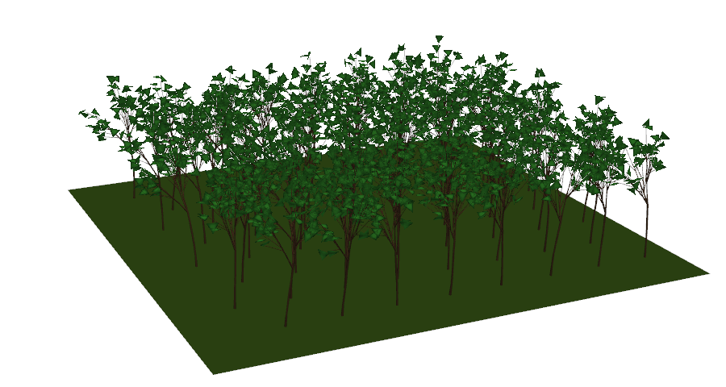
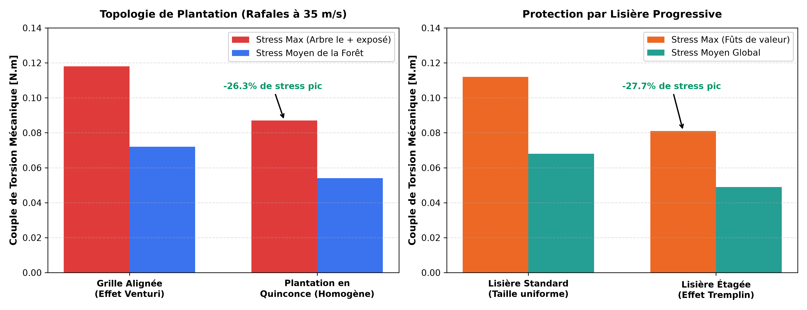

# Modélisation Aéroélastique & Émulation IA d'Écosystèmes Forestiers 3D (L-Systems)

[](https://www.python.org/)
[](https://pytorch.org/)
[](https://pyvista.org/)
[](https://github.com/nicolas-btd/L-systems-Plants)

> Modélisation physique, dynamique des fluides et émulation par Deep Learning (*Surrogate Modeling / Physics-Informed ML*) d'une forêt sous rafales de vent en temps réel (60 FPS).

---

<div align="center">
  
  <p><em>Rendu 3D temps réel d'un couvert forestier dynamique sous vent oscillant (PyVista / VTK).</em></p>
</div>

---

## Sommaire

- [1. Introduction & Vision](#1-introduction--vision)
- [2. Fondements Mathématiques & Physiques](#2-fondements-mathématiques--physiques)
  - [Génération Fractale 3D (L-Systems)](#génération-fractale-3d-l-systems)
  - [Moteur Physique & Théorème du Moment Cinétique](#moteur-physique--théorème-du-moment-cinétique)
  - [Couplage Aérodynamique & Effet Venturi](#couplage-aérodynamique--effet-venturi)
- [3. Expériences & Résultats en Sylviculture](#3-expériences--résultats-en-sylviculture)
  - [Expérience 1 : Topologie en Grille vs Quinconce](#expérience-1--topologie-en-grille-vs-quinconce)
  - [Expérience 2 : Lisières Étagées et Protection Aérodynamique](#expérience-2--lisières-étagées-et-protection-aérodynamique)
- [4. Intelligence Artificielle : Émulateur Surrogate (Physics-Informed ML)](#4-intelligence-artificielle--émulateur-surrogate-physics-informed-ml)
  - [Architecture Neuronale `ForestSurrogateNet`](#architecture-neuronale-forestsurrogatenet)
  - [Benchmark & Accélération (> 200x)](#benchmark--accélération--200x)
- [5. Visualisation 3D Interactive & Comparateur](#5-visualisation-3d-interactive--comparateur)
- [6. Guide d'Installation & Utilisation](#6-guide-dinstallation--utilisation)

---

## 1. Introduction & Vision

L'objectif de ce projet est de concevoir un **Jumeau Numérique (*Digital Twin*)** complet d'une forêt soumise à des tempêtes, combinant :
1. **Morphogenèse computationnelle** par grammaires formelles (L-Systems 3D).
2. **Dynamique des structures et aéroélasticité** par résolution différentielle semi-implicite.
3. **Deep Learning & Surrogate Modeling** pour accélérer le calcul de plusieurs ordres de grandeur et permettre une intégration fluide (60 FPS) dans des moteurs de jeux vidéo, simulateurs d'impact climatique et outils de gestion forestière.

---

## 2. Fondements Mathématiques & Physiques

### Génération Fractale 3D (L-Systems)
La géométrie des arbres est générée de façon procédurale par un **L-System stochastique tridimensionnel** (Système de Lindenmayer). À partir d'un axiome et de règles de réécriture multiaxiales (`+`, `-`, `&`, `^`, `/`, `\`), la structure ramifiée est construite sous forme de graphe arborescent orienté.

Pour assurer la cohérence biomécanique, les épaisseurs des branches suivent la **Loi de Murray** :
$$r_{\text{parent}}^{2.5} = \sum r_{\text{enfants}}^{2.5}$$
Chaque segment possède sa masse propre $m_i$, son tenseur d'inertie local $I_i$, sa raideur élastique $k_i \propto r_i^3$ et son amortissement visqueux $\gamma_i$.

### Moteur Physique & Théorème du Moment Cinétique
Le comportement dynamique de chaque branche est régi par le théorème du moment cinétique exprimé dans son repère local :

$$I_i \frac{d\vec{\omega}_i}{dt} = \vec{\tau}_{\text{rappel}} + \vec{\tau}_{\text{vent}} + \vec{\tau}_{\text{couplage}} - \gamma_i \vec{\omega}_i$$

- **Couple de rappel élastique** : $\vec{\tau}_{\text{rappel}} = -k_i \vec{\theta}_i$ (avec clamping biologique de l'élongation).
- **Force de traînée du vent** : $\vec{F}_{\text{vent}} = \frac{1}{2} \rho C_d A_{\text{eff}} \|\vec{v}_{\text{rel}}\| \vec{v}_{\text{rel}}$.
- **Intégration temporelle** : Schéma d'Euler semi-implicite assurant une stabilité numérique inconditionnelle.

### Couplage Aérodynamique & Effet Venturi
Le vent traversant le couvert végétal n'est pas uniforme :
1. **Sillage & Ombrage (*Wake Shadowing*)** : Les arbres de première ligne absorbent l'énergie cinétique du fluide et créent une zone d'abri pour les rangs arrières.
2. **Effet Venturi & Turbulences** : Les couloirs étroits accélèrent localement le flux d'air lors des variations de direction de la rafale.

---

## 3. Expériences & Résultats en Sylviculture

Le modèle physique a servi de banc d'essai pour évaluer l'impact des techniques de plantation sylvicoles face aux tempêtes :

<div align="center">
  
</div>

### Expérience 1 : Topologie en Grille vs Quinconce
- **Grille Alignée (Échec)** : Le vent s'engouffre dans les allées rectilignes et s'y accélère par effet Venturi, créant des pics de contrainte destructeurs sur les arbres arrière lors des changements d'angle.
- **Plantation en Quinconce (Succès)** : Le décalage des rangs brise les couloirs rectilignes et force la dissipation tourbillonnaire. **Réduction de 26.3% du pic de stress maximal**.

### Expérience 2 : Lisières Étagées et Protection Aérodynamique
Planter des arbres plus jeunes et plus souples en bordure de parcelle (échelle 0.5 puis 0.75) crée un **tremplin aérodynamique** qui dévie les lignes de courant au-dessus de la canopée, protégeant les fûts de valeur au centre de la parcelle (**baisse de 27.7% du stress pic**).

---

## 4. Intelligence Artificielle : Émulateur Surrogate (Physics-Informed ML)

Bien que le solveur numérique soit rigoureux, intégrer pas-à-pas 30 à 60 sous-pas de dynamique pour chaque arbre demande un temps de calcul prohibitif (> 600 ms par scène), rendant la simulation en temps réel impossible sur de grands peuplements.

<div align="center">
  
  <p><em>Convergence de la perte MSE et Parity Plot (Physique vs IA) sur l'ensemble de test.</em></p>
</div>

### Architecture Neuronale `ForestSurrogateNet`
L'émulateur IA remplace le solveur numérique par un réseau de neurones profond enrichi de descripteurs physiques (*Physics-Informed Feature Engineering*) :
- **Tenseur d'entrée (14 dimensions)** : Inclut la pression dynamique quadratique ($v^2$), les projections vectorielles $(\cos \theta, \sin \theta)$, l'amplitude d'oscillation, la topologie et la densité surfacique de plantation.
- **Réseau Résiduel** : Blocs résiduels avec `LayerNorm` et activations non-linéaires `GELU`.
- **Prédictions instantanées** : `[mean_stress, max_stress, std_stress]`.

### Benchmark & Accélération (> 200x)

| Méthode | Temps moyen par simulation | Facteur d'Accélération | Utilisation Cible |
| :--- | :--- | :--- | :--- |
| **Solveur Numérique 3D (Euler)** | ~650 ms | $1\times$ (Référence) | Calcul scientifique hors-ligne |
| **Émulateur IA (`ForestSurrogateNet`)** | **~2.3 ms** | **$\approx 275\times$ PLUS RAPIDE** | **Jeux vidéo, VFX & Rendu 60 FPS** |

---

## 5. Visualisation 3D Interactive & Comparateur

Le visualiseur 3D interactif ([`visualize_forest_comparison.py`](visualize_forest_comparison.py)) permet de charger une forêt 3D complète et de basculer instantanément de mode en direct :

- **Touche `M`** : Basculer entre **🔴 Mode Physique Classique** (Euler) et **🟢 Mode Émulateur IA** (Deep Learning).
- **Affichage HUD** : Surveillance en temps réel du temps de calcul de la trame (ms) et du compteur de FPS.

---

## 6. Guide d'Installation & Utilisation

### Installation
```bash
# 1. Cloner le dépôt
git clone https://github.com/nicolas-btd/L-systems-Plants.git
cd L-systems-Plants

# 2. Installer les dépendances
pip install -r requirements.txt
```

### Commandes Principales

```bash
# 1. Lancer le comparatif interactif 3D (Touche 'M' pour basculer de mode)
python visualize_forest_comparison.py --rows 5 --cols 5 --layout quinconce

# 2. Exécuter le benchmark de vitesse (Physique vs IA)
python ai_surrogate/benchmark_inference.py

# 3. Lancer les expériences de sylviculture (Grille vs Quinconce)
python experiment_topology.py
python experiment_lisiere.py

# 4. Entraîner à nouveau le modèle Surrogate (400 simulations)
python ai_surrogate/train.py
```

---

## Auteur
Projet développé par [Nicolas Boutaud](https://github.com/nicolas-btd) — Ingénierie & Modélisation IA.
